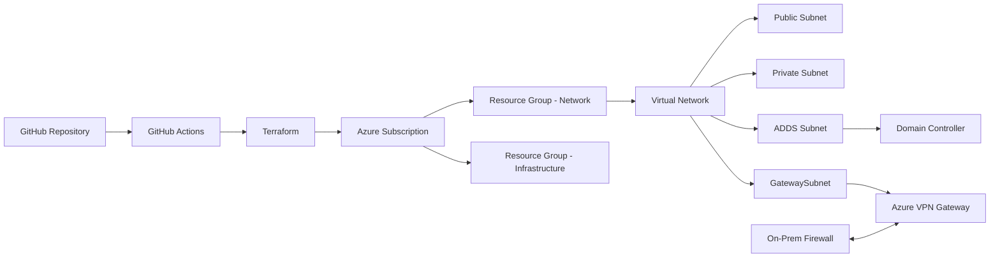
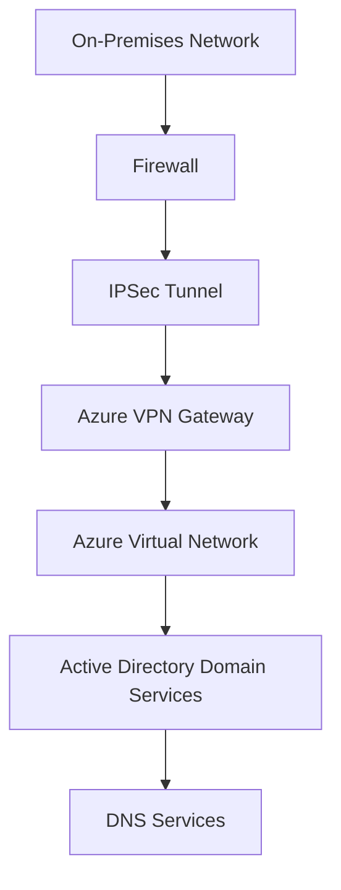
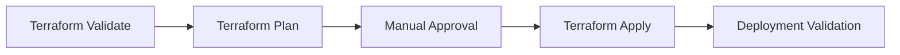

<div align="center">

# Motwane Production Landing Zone

Production-ready Azure Infrastructure Platform built using Terraform reusable modules and GitHub Actions.

<br>

<p align="center">


</p>

<p align="center">


</p>

</div>

---

# Overview

This repository contains the Infrastructure as Code (IaC) implementation for the Motwane Production Landing Zone in Microsoft Azure.

The platform has been designed to provide a standardized, scalable and repeatable deployment model using reusable Terraform modules and GitHub Actions CI/CD pipelines.

The deployment provisions core networking, identity and connectivity services required for production workloads.

---

# Architecture



---

# Deployment Architecture



---

# Technology Stack

| Layer                  | Technology                       |
| ---------------------- | -------------------------------- |
| Cloud Platform         | Microsoft Azure                  |
| Infrastructure as Code | Terraform                        |
| CI/CD                  | GitHub Actions                   |
| Identity               | Active Directory Domain Services |
| Connectivity           | Azure VPN Gateway                |
| DNS                    | Active Directory Integrated DNS  |
| Authentication         | Azure Service Principal          |
| Source Control         | GitHub                           |
| State Backend          | Azure Storage Account            |

---

# Infrastructure Components

## Networking

### Virtual Network

| Property      | Value         |
| ------------- | ------------- |
| Region        | Central India |
| Address Space | 172.20.0.0/22 |

### Subnets

| Subnet        | CIDR          |
| ------------- | ------------- |
| Public        | 172.20.0.0/24 |
| Private       | 172.20.1.0/24 |
| ADDS          | 172.20.2.0/24 |
| GatewaySubnet | 172.20.3.0/26 |

---

## Identity Services

### Active Directory Domain Services

| Configuration     | Value                       |
| ----------------- | --------------------------- |
| Domain Controller | 1                           |
| DNS               | Active Directory Integrated |
| Deployment        | Automated                   |
| Domain Join       | Automated                   |

---

## Connectivity

### Azure VPN Gateway

| Configuration     | Value       |
| ----------------- | ----------- |
| SKU               | VpnGw1AZ    |
| VPN Type          | Route-Based |
| Active-Active     | Disabled    |
| BGP               | Disabled    |
| Availability Zone | Zone 1      |

---

# Naming Standards

| Resource          | Naming Pattern          |
| ----------------- | ----------------------- |
| Resource Group    | client-env-region-rg-*  |
| Virtual Network   | client-env-region-vnet  |
| Domain Controller | client-env-region-dc-*  |
| VPN Gateway       | client-env-region-vpngw |
| Public IP         | client-env-region-pip-* |

### Example

```text
motwane-prod-cin-rg-network

motwane-prod-cin-rg-infra

motwane-prod-cin-vnet

motwane-prod-cin-dc-01

motwane-prod-cin-vpngw

motwane-prod-cin-pip-vpngw
```

---

# CI/CD Pipeline



---

# Repository Structure

```text
motwane-ad

├── .github
│   └── workflows
│       └── terraform-deploy.yml
│
├── envs
│   └── prod
│       ├── main.tf
│       ├── variables.tf
│       └── outputs.tf
│
└── README.md
```

---

# Deployment

## GitHub Actions

```text
Actions
→ Run Workflow
→ Manual Approval
→ Production Deployment
```

## Terraform

```bash
terraform init

terraform plan

terraform apply
```

---

# Security Controls

* Remote Terraform State
* Azure Service Principal Authentication
* GitHub Secrets
* Network Segmentation
* Dedicated Gateway Subnet
* Manual Production Approval Workflow

---

# Contributors

| Name           | Contribution                                                                                                    |
| -------------- | --------------------------------------------------------------------------------------------------------------- |
| Darshan Thenge | Azure Architecture, Terraform Module Development, GitHub Actions CI/CD, ADDS Automation, VPN Gateway Automation |

---

# License

Internal Use Only
