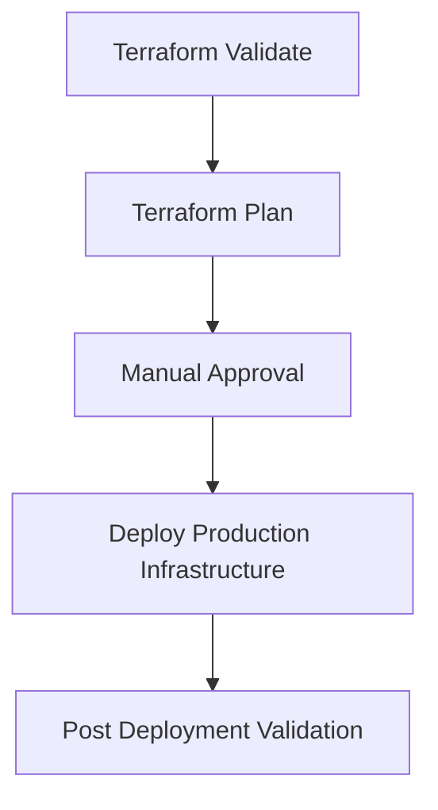

<div align="center">

# 🚀 Motwane Production Azure Landing Zone

### Enterprise Azure Infrastructure Platform powered by Terraform & GitHub Actions

<p align="center">


</p>

---

Production Infrastructure as Code (IaC) implementation for Motwane Manufacturing.

</div>

---

# 📊 Project Status

| Component                   | Status      |
| --------------------------- | ----------- |
| Terraform Reusable Modules  | ✅ Completed |
| Virtual Network Deployment  | ✅ Completed |
| Active Directory Deployment | ✅ Completed |
| DNS Configuration           | ✅ Completed |
| VPN Gateway Deployment      | ✅ Completed |
| GitHub Actions CI/CD        | ✅ Completed |
| Production Rollout          | ✅ Completed |

---

# 🏢 Project Information

| Property               | Value                   |
| ---------------------- | ----------------------- |
| Customer               | Motwane Manufacturing   |
| Environment            | Production              |
| Azure Region           | Central India           |
| Deployment Method      | GitHub Actions          |
| Infrastructure as Code | Terraform               |
| VPN SKU                | VpnGw1AZ                |
| Authentication         | Azure Service Principal |
| State Backend          | Azure Storage Account   |

---

# 🏗️ Solution Architecture

```text
                                        ┌──────────────────────────┐
                                        │    GitHub Repository     │
                                        └─────────────┬────────────┘
                                                      │
                                                      ▼

                                        ┌──────────────────────────┐
                                        │   GitHub Actions CI/CD   │
                                        └─────────────┬────────────┘
                                                      │
                                                      ▼

                                        ┌──────────────────────────┐
                                        │       Terraform          │
                                        └─────────────┬────────────┘
                                                      │
                                                      ▼

═══════════════════════════════════════════════════════════════════════
                    MICROSOFT AZURE - CENTRAL INDIA
═══════════════════════════════════════════════════════════════════════

                            ┌───────────────────────┐
                            │  Azure VPN Gateway    │
                            │      VpnGw1AZ         │
                            └───────────┬───────────┘
                                        │
                                 Site-to-Site VPN
                                        │
                                        ▼

                            ┌───────────────────────┐
                            │   On-Prem Firewall    │
                            │ FortiGate / Palo Alto │
                            │ Sophos / Cisco ASA    │
                            └───────────────────────┘


┌───────────────────────────────────────────────────────────────────┐
│ Azure Virtual Network                                             │
│ 172.20.0.0/22                                                     │
└───────────────────────────────────────────────────────────────────┘

     │
     ├── Public Subnet          172.20.0.0/24
     │
     ├── Private Subnet         172.20.1.0/24
     │
     ├── ADDS Subnet            172.20.2.0/24
     │          │
     │          ▼
     │     Domain Controller
     │     Active Directory
     │     DNS Server
     │
     └── GatewaySubnet          172.20.3.0/26
```

---

# 🌐 Network Design

## Virtual Network

| Property      | Value                 |
| ------------- | --------------------- |
| VNet Name     | motwane-prod-cin-vnet |
| Address Space | 172.20.0.0/22         |

## Subnet Layout

| Subnet        | CIDR          |
| ------------- | ------------- |
| Public        | 172.20.0.0/24 |
| Private       | 172.20.1.0/24 |
| ADDS          | 172.20.2.0/24 |
| GatewaySubnet | 172.20.3.0/26 |

---

# 🔐 Active Directory Services

| Configuration     | Value                       |
| ----------------- | --------------------------- |
| Domain Controller | 1                           |
| Domain Name       | ad.motwane.com              |
| DNS               | Active Directory Integrated |
| Deployment        | Automated                   |
| Join Method       | Terraform Provisioning      |

---

# 🔗 VPN Gateway Configuration

| Configuration     | Value            |
| ----------------- | ---------------- |
| Gateway SKU       | VpnGw1AZ         |
| VPN Type          | Route-Based      |
| BGP               | Disabled         |
| Active-Active     | Disabled         |
| Availability Zone | Zone 1           |
| Connectivity      | Site-to-Site VPN |

---

# ♻️ Reusable Terraform Modules

This deployment leverages centralized reusable Terraform modules.

## Modules Used

| Module      | Purpose                      |
| ----------- | ---------------------------- |
| Network     | VNet, Subnets, NSGs          |
| ADDS        | Domain Controller Deployment |
| VPN Gateway | Azure VPN Gateway            |

## Future Modules

* Azure Bastion
* Azure Backup
* Azure Key Vault
* Azure Monitor
* Log Analytics Workspace
* Azure Virtual Desktop

---

# 📐 Naming Standards

| Resource Type     | Naming Convention       |
| ----------------- | ----------------------- |
| Resource Group    | client-env-region-rg-*  |
| Virtual Network   | client-env-region-vnet  |
| Domain Controller | client-env-region-dc-*  |
| VPN Gateway       | client-env-region-vpngw |
| Public IP         | client-env-region-pip-* |

### Examples

```text
motwane-prod-cin-rg-network

motwane-prod-cin-rg-infra

motwane-prod-cin-vnet

motwane-prod-cin-dc-01

motwane-prod-cin-vpngw

motwane-prod-cin-pip-vpngw
```

---

# 🔄 CI/CD Pipeline



---

# 📂 Repository Structure

```text
motwane-ad

├── .github
│   └── workflows
│       └── terraform-deploy.yml
│
├── envs
│   └── prod
│       ├── main.tf
│       ├── variables.tf
│       └── outputs.tf
│
└── README.md
```

---

# 🔒 Security Controls

* Remote Terraform State
* GitHub Secrets Management
* Azure Service Principal Authentication
* Infrastructure as Code Governance
* Network Segmentation
* Dedicated Gateway Subnet
* Manual Production Approval Workflow

---

# 🚀 Deployment

### GitHub Actions

```text
Actions
→ Run Workflow
→ Manual Approval
→ Production Deployment
```

### Terraform

```bash
terraform init

terraform plan

terraform apply
```

---

# 📈 Roadmap

* Azure Bastion
* Azure Backup
* Key Vault Integration
* Azure Monitor
* Log Analytics
* VPN Connection Automation
* Hub & Spoke Networking
* Disaster Recovery Design

---

# 👥 Contributors

| Name           | Contribution                                                                                                    |
| -------------- | --------------------------------------------------------------------------------------------------------------- |
| Darshan Thenge | Azure Architecture, Terraform Module Development, GitHub Actions CI/CD, ADDS Automation, VPN Gateway Automation |

---

# 📄 License

Internal Use Only

---

<div align="center">

### Built using Microsoft Azure, Terraform & GitHub Actions

</div>
